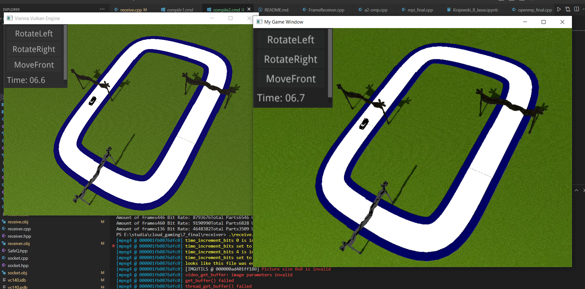

# Game streaming
This program is about streaming a game.
The game is coded using Vienna Vulkan Engine: https://github.com/hlavacs/ViennaVulkanEngine
so engine has to be downloaded first.

# Sample video:
# Used technologies
- SDL2
- FFMPEG
- WINSOCKET
- NUCLEAR
# How does it work
## Sending frames
In Vienna Vulkan Engine the screenshot is taken every x time (with certain frameRatio), then its encoded using FFMPEG (mpeg4 in my case). Then by using sockets its sent somewhere (IPv4 + UDP). Whats important is that maximally 1400 bytes are sent so frames are divided on smaller parts!.
## Receiving frames 
On the other side there is a receiver which wait for the packets. Receiver  combines the packets into frames, decodes it and in the end sends it to SafeQueue (queue of frames). Another thread waits till queue has some values in it and then reads whats in that. 

## Sending information back
Receiver can send informations back (its stream, and its going to be developed further to control the game) as for now it sends back to sender basic information about frames.

## How to run

You have to have Vienna Vulkan Engine, MSVC and use C ++ 20.

Sender part:
First copy all files from Vulkan Changes to Vienna vulkan engineand then hen compile --> sender part is done here.
Receiver part:
Use MSVC terminal and run compile1.cmd
receive.cpp is the main program.

Run /receive.exe and then  SDL window will pop up.

Now click <kbd>c</kbd> in vulkan engine and enjoy your stream.

<kbd>w</kbd> Move forward
<kbd>s</kbd> Move back
<kbd>a</kbd> Rotate left
<kbd>d</kbd> Rotate right
<kbd>r</kbd> Reset the game
<kbd>esc</kbd> Quit the game 